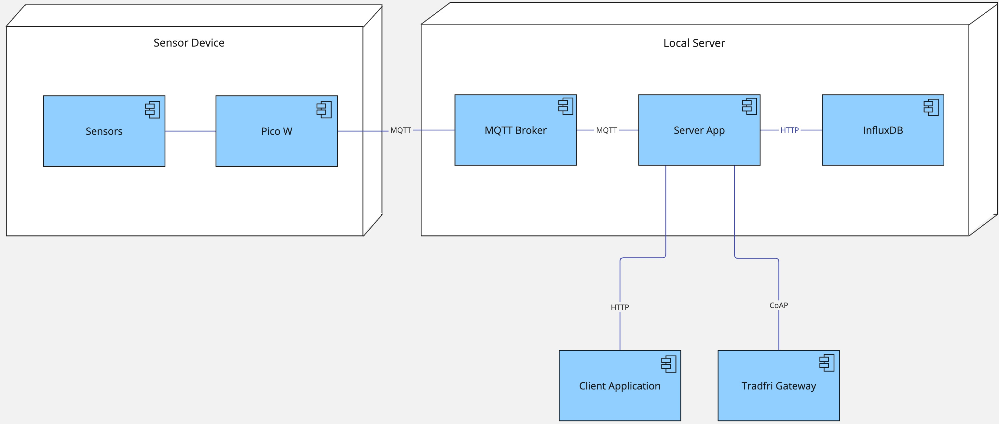
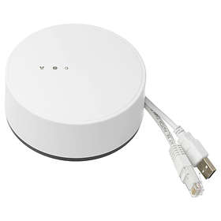
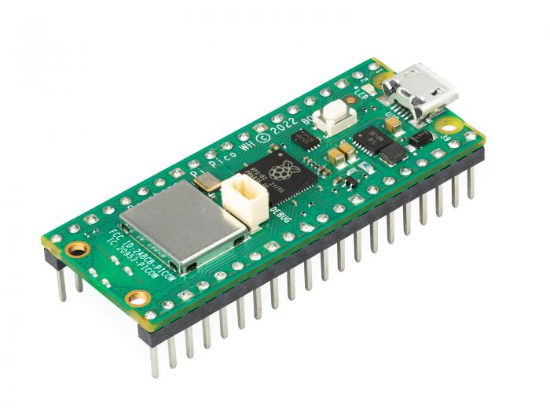
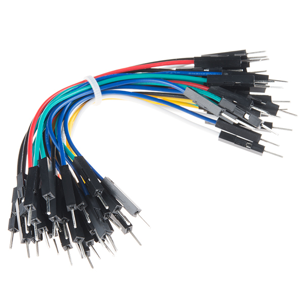
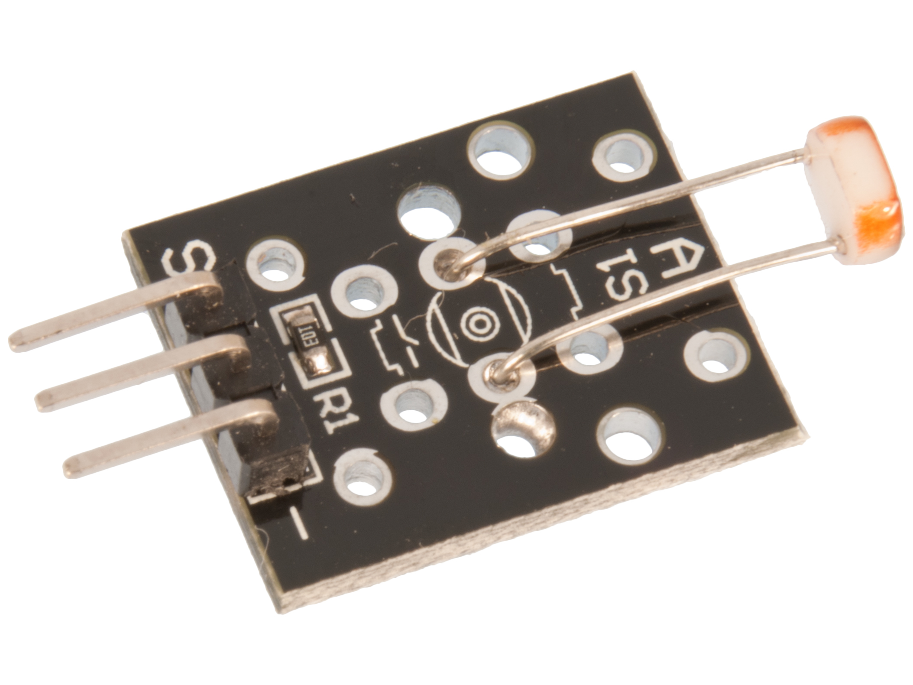
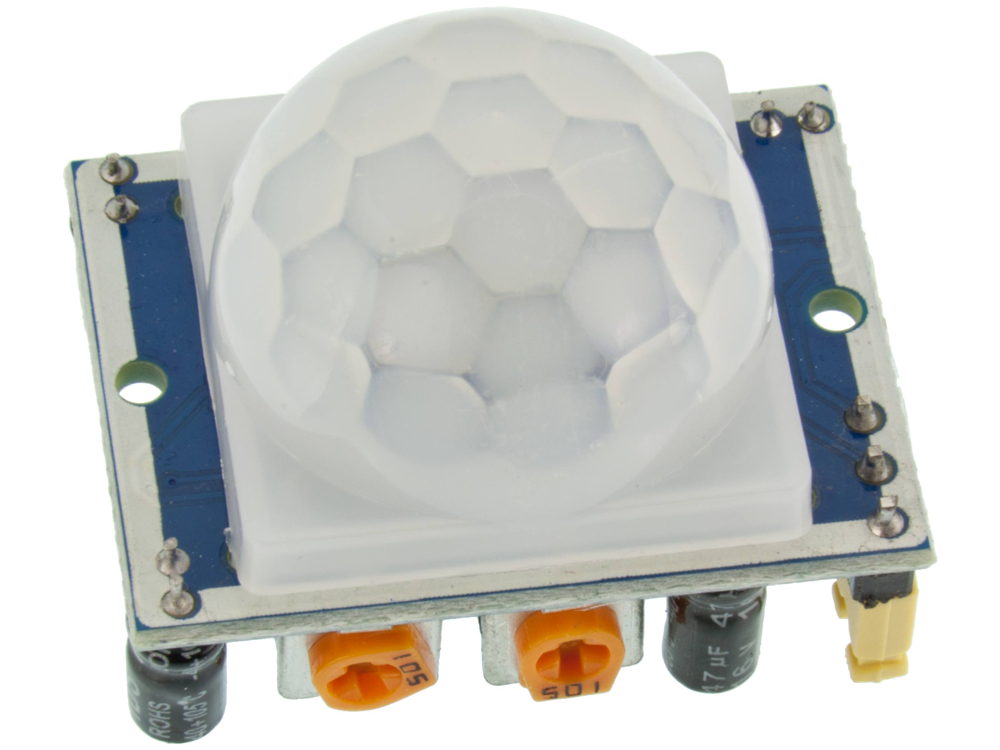
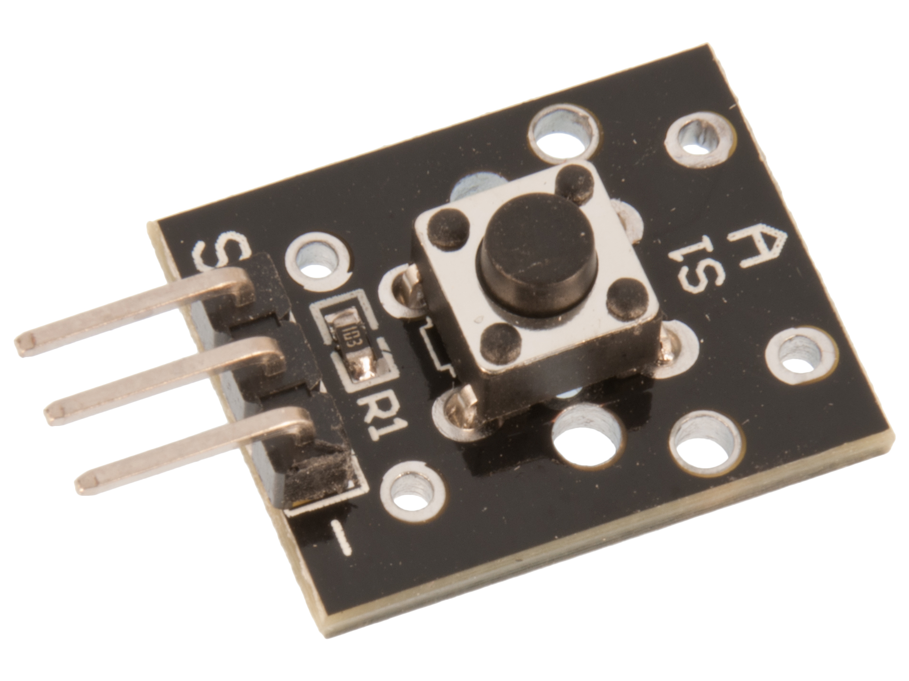
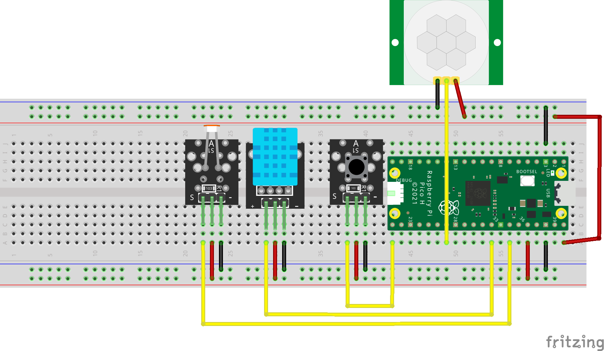

# How to build a automation system for IKEA Tradfri

**Author:** Henrik Lagrosen, (hl223qb)

**Overview:**

This tutorial will show you how to set up a Raspberry Pico W to provide more automation abilities to the Ikea Tradfri system. The resulting system will be able to automate Tradfri commands based on data from the sensors connected to one or more Pico W's. The available sensors to use are a temperature sensor, a humidity sensor, a light sensor and a motion sensor.



As shown above, it consists of a Raspberry Pico W, a server running Python and a Tradfri gateway. The Pico W is used to control the Tradfri devices and to send data to the server. The server is used to manage the data and to communicate with the Tradfri gateway. This is designed to be a fun hobby project, which could also result in an actually useful end-product. I think it is suitable for beginners in the field, but be careful with the hardware. **I claim no responsibility for any damages made to anything, regardless of cause.**

**Time investment:**

All the software is already written, so the time investment is mostly in setting up the hardware and the software. The hardware should not take long, as all it takes is to follow the wiring diagram. The time required to setup the software is depends a lot on experience and luck. With a solid amount of programing and installing experience and no issues, it wouldn't take more than 45 minutes with nothing pre-installed. If you are new to programing and installing, it could take up to 2 hours. If you run into issues, it could take even longer. In total I would estimate 1.5 - 3.5 hours to setup the entire project, depending on experience and luck.


## Objective

**Project selection decision:**

I have some previous experience with developing software integrating with the IKEA Tradfri product line. Those projects were aimed to 
extend the existing functionallity of the smart home system and were highly tailored to suit my own needs. I learned that it was both
fun and easy to work with the Tradfri system and as it fitted well with the requirements of the course, I decided to build a project
that works as an extension to the Tradfri system.

**Purpose:**

This project aims to be a IoT project that other people can use or build upon. Being a popular product line, I can see others finding 
benefit in this project, both in learning and also for the practical use of the end product.

**Data Usage:**

The Pico W will send the sensor data to the server. The server will then use this data to trigger automations based on the data. For instance, if the motion sensor detects motion, the server could turn on a Tradfri light. The server will also store the data in a time series database, enabling the creation of graphs and other visualisations of the data. The main function of the system is still to create automations based on the sensor data, but the visualisations could be a supporting feature. It would help the user to create automations, knowing what values the sensors produces in one day-cycle. The user might know that they want the light to turn on when it is as dark as it was at 6 PM yesterday, for instance. The data could also be useful for monitoring, increasing understanding and for debugging.

**Possible insights:**

There are some aspects of the project that are newer to me. I have not made tutorials of this kind and I think that some of the data-visualisation tools will be new to me as well. I expect to learn more about both areas and how to operate with them more efficiently.
I think I will learn more about how to convey the instructions in a clear and concise way, and also how to make the project more appealing and
understandable to the reader.


## Material

|Image | Name | Info | Price |
| ---- | ---- | ---- | ----- |
|  | Tradfri Gateway E1526 | The gateway used to control the Tradfri devices. It is connected to the server over ethernet. **Other gateways are not guarenteed to work!** | Unavailable for new purchase, easy to find used. Around 400 SEK. |
|  | Raspberry Pi Pico W | The microcontroller used for connecting the sensors to the application. Comes with a pre-soildered header and a built-in WiFi antenna. | 109 SEK at [Electrokit](https://www.electrokit.com/raspberry-pi-pico-wh) |
|  | Jumper Cables | 10 cm long, male to male cables used to connect the sensors to the Pico W. | 39 SEK at [Electrokit](https://www.electrokit.com/labbsladdar-100mm-hane/hane-30-pack) |
|  | DHT11 | A digital temperature and humidity sensor which can be used with the dht library for easy reading. | 49 SEK at [Electrokit](https://www.electrokit.com/digital-temperatur-och-fuktsensor-dht11) |
|  | Light Sensor | An analog light sensor. Very easy to use because it has a seperate pin for reading and it does not need resistors for our application. | 39 SEK at [Electrokit](https://www.electrokit.com/ljussensor) |
|  | HC-SR501 | A motion sensor that can be used to detect movement. It has a digital output, high if motion is detected, low if not. Requires 5V power, but there is a way to get it from the Pico W. | 39 SEK at [Electrokit](https://www.electrokit.com/pir-rorelsesensor) |
|  | Push Button | Simple push button with built-in resistors. It has one pin which will be high when the button is pushed. | 19 SEK at [Electrokit](https://www.electrokit.com/tryckknapp-momentan) |

>    NOTE: Not all of the components I used were bought at the specified stores at the specified prices as some of the components were already in my possession.


## Computer setup

**My IDE choice:**

The IDE I chose for working with this project is Visual Studio Code. The most major factors behind the decision were the extendability of the code editor which allows for fine tuning the editor to my liking, and because I have a lot of previous experience with the editor. You can use whichever editor you prefer, but the instructions will be tailored to Visual Studio Code with the PyMakr plugin.

**Setting up Visual Studio Code:**

First, you need to install Node.js, using instructions available on [this page](https://nodejs.org/en/). This is needed for the PyMakr plugin to function. Then, you need to install Visual Studio Code from [this page](https://code.visualstudio.com/Download). After installing the editor, you can install the PyMakr plugin by searching for it in the extensions tab. 

**Setting up the Pico W:**

To be able to deploy MicroPython code on the the Pico W, you need to first flash the MicroPython firmware to the device. Start by connecting the Pico W to a micro USB cable. While holding the BOOTSEL button, connect the other end of the cable to your computer. After connected, you can release the BOOTSEL button and the Pico W should appear as a USB drive on your computer. You can then download the MicroPython firmware from [this](https://micropython.org/download/RPI_PICO_W/) page, and copy the .uf2 file onto the Pico W drive. After this, the Pico W should automatically install and disconnect from you computer, after which you can unplug the cable. The pico W is now ready to run MicroPython code, which can be done by connecting it to the computer again, opening the PyMakr menu in Visual Studio Code, selecting ADD DEVICES and then selecting the Pico W from the list of available devices. Then press the connect button on the device entry, and also the `Start Development Mode` button on the project. Everytime you save a file in the pico directory now, the code will be uploaded to the Pico W. Some of the variables could not be uploaded to the repository, so you need to add them yourself. You need to create a file in `Applied-IoT/pico/lib` called `env.py`. In this file, you need to add the following variables:
`
```python
WIFI_SSID="" # The name of your WiFi network
WIFI_PASS="" # The password to your WiFi network
BROKER_ADDRESS="" # The IP address of the machine on which you want to run the server
BROKER_PORT=1883 # The port on which the MQTT broker is running, default is 1883
DEVICE_ID=1 # A unique identifier for the Pico W, used for triggering automations based on values from specific sensor-devices. Must be unique for each Pico W in the system, and must be a positive integer.
DISABLED_SENSORS="" # A comma separated list of sensors to disable. The available sensors are "motion", "temperature", "light" and "button". For instance, "motion,light" would disable the motion and light sensors.
```

**Setting up the local server:**

The server is used to coordinate the Pico W devices (in case there are multiple in your setup), to communicate with the Tradfri gateway and to manage the data. In my case, I used a Raspberry Pi 4 running Raspbian, but any Linux/Mac OS should be fine. Windows could work to, but has not been tested. To setup the server, you need to install Docker Engine, Docker CLI and Docker Compose. Luckily, you can install all of these at once by installing Docker Desktop. Instructions for installing Docker Desktop on any platform can be found [here](https://docs.docker.com/desktop/). 

> The following commands will work for Linux and Mac OS. For Windows users, one alternative is using the [Git Bash](https://gitforwindows.org/) terminal.

To run the server, you need to download this repository to the server: 

```bash
git clone https://github.com/helagro/Applied-IoT.git
```

Then, you need to navigate to the `server` directory:

```bash
cd Applied-IoT/server
```

Set the tradfri gateway code which can be found on the bottom of your device (this step only needs to be included to setup and when your network configuration changes):

```bash
export TRADFRI_CODE="YOUR_CODE"
```

Then, you can start the server using the following commands:

```bash
export TRADFRI_ADDR="YOUR_GATEWAY_IP"
docker-compose up
```

The server should now be running on port 3000 of your device. You can access the frontend by going to `http://localhost:3000/static/index.html` in your browser. You can also access it from other devices on the same network by replacing `localhost` with the IP address of the server.

## Putting everything together




**Electrics:**
Due to the choice of components, this entire setup require no additional resistors. The light sensor has a seperate pin for reading, and the push button has built-in resistors. The DHT11, button and light sensor all perform fine when powered with 3.3V. The motion sensor requires 5V power, but you can draw that from the USB input using the VBUS pin. Without it, the signal becomes highly irregular and random. This is not ideal as this bypasses features of the Pico W, like voltage regulation, overvoltage protection and backfeeding protection. An example of backfeeding is if you instead of drawing power from the VBUS, you accidentally power it. **This can cause damage to the device that the Pico is connected to (for instance, your expensive computer 😳).** This is one part of the design which makes it unsuitable for production, but it is fine for a home project. Some other reasons are the innefficient wiring, lack of protection and that the button is not as easy to press as it should be.

**Production:**
For a production setup, an external power module supply should be used, together more optimised wiring, pin usage and preferably a case of sorts. A case could quite easily be 3D printed, improving both looks, dust protection, ease of directing sensors and durability. 

**Color coding:**
The diagram's wires are color coded, and I would recommend you do that too if possible. Red means power, black means ground and yellow means signal, i.e. where the data is read from.

**Breadboard layout:**

This breadboard works by having the two outer rows (blue and red), be connected like a row, meaning that all the pins in the blue rows use the same ground, and all the pins in the red row use the same power. The other pin-holes are connected by columns, meaning that all the pins in the same column are connected. 

- [ ] *Electrical calculations
  - [ ] current and voltage

## Platform

This project does not use a cloud platform, instead it uses a local InfluxDB database. InfluxDB is a free time series database, although they have payed cloud options too. InfluxDB is specifically optimised for storing datapoints with a timestamp. It allows for tagging datapoints, and efficient filtering using those tags. Filtering by time is also highly optimised, given that it is a very common use-case for time-series databases. 

For visualisation, it uses a Flutter client application. In the repository, there is a uploaded web-build of it, which can be accessed from any device on the same network as the server. The Flutter code is in the repository meaning it should be able to be built for most platforms. It has been tested on Web, Android and MacOS, iOS would probably require some additional configuration. To make the graphs, the Flutter library [FL Chart](https://github.com/imaNNeo/fl_chart/tree/main?tab=readme-ov-file) is used.

**Platform choices:**

There were a few major factors influencing the choice of storage and visualisation solution. The choice was made rather late in the application's development, by then there already was on functioning client application. It made sense to use that for visualisation. The project already required a server for running the backend code, meaning installing a database on it aswell would not add much extra complexity. The backend code already had code for recieving and interpreting sensor data sent from the Pico W, so it made sense to insert the data storage at the backend, rather than having a seperate module listening for mqtt messages. 

There were very few constraints on the project, performance would most likely not be an issue given that one server should easily be able to handle the load generated by quite a few Pico W's. Reliability was not a major concirn either. The system is not crutial and it is very simple to restart. Therefore, ease of development and setup for the user could take more of a priority.

Using a platform like Adafruit, Ubidots or Node-Red would likely require more user setup, meaning making this README even longer and making more opportunities for errors. 

These factors all leaned towards installing a local database and using the Flutter client application for visualisation. The development would be easy, it would have a minimal impact on project complexity, it would not bottleneck the system in any significant manner, and the setup could be fully automated.

**Scaling:**

As touched upon earlier, scaling this project should be very easy and the current configuration should be able to handle most realistic usage and traffic. If the system were to be scaled, I still maintain that the current visualisation techniques (the Flutter library and the InfluxDB database) are the best choice. Having a local database is ideal, allowing for very high reponsiveness, and the lack of some of the overhead present with some of the above mentioned platforms is also good for performance. The Flutter library is also more than capable of graphing a large amount of data. The only changes that would be needed would be some slight alterations to the system architecture.

To allow for distributing the load to multiple servers, the broker, python server and database should be further separated. The client applications should connect to the InfluxDB directly, instead of having all data relayed through the Python server. The database should also be more directly connected to the MQTT broker, as it has to be separated from the Python server. This new architecture should be able to suit even intense industrial usage, given that the servers are powerful enough. For that usage however, security should be of way more concirn, which is not at all considered at them moment. Given that the system is not connected to the internet, no cloud scaling will ever be needed.

One alternate scaling solution could be to implement a full local TIG-stack. This means adding the programs Telegraf and Grafana to the system. Telegraf would be used to collect the data from the MQTT broker and send it to the InfluxDB database. Grafana would be used to visualise the data. This would allow for more advanced visualisations and more advanced data collection. This could be a more optimised setup as more under the hood optimisations have been made for these specialised programs. This could allow the system to process and visualise larger and more complex sets of data.

## The code

The code below is the main loop of the Pico W. It is responsible for polling the sensors at the specified intervals, and for sending the data to the server if a new value is registered. It uses the four polling functions `pollMotion`, `pollTemp`, `pollLight` and `pollBtn` to get the sensor data. The `MAIN_POLL_INTERVAL` is delay between each iteration of the loop. The button is polled at every iteration, as responsiveness is prioritised and no noise is expected. The other sensors are polled at a lower frequency, by using counter variables to keep track of how many iterations have passed since the last poll. If the counter reaches the specified maximum value, the sensor is polled and the counter is reset.

```python
while True:
    if(motionCounter >= motionCounterMax):
        pollMotion()
        motionCounter = 0

    if(tempCounter >= tempCounterMax):
        pollTemp()
        tempCounter = 0

    if(lightCounter >= lightCounterMax):
        pollLight()
        lightCounter = 0

    pollBtn()

    time.sleep(MAIN_POLL_INTERVAL)

    # Increment counters
    motionCounter += 1
    tempCounter += 1
    lightCounter += 1
```

The following code snippet shows one of the polling functions, `pollMotion`. It is responsible for polling the motion sensor and sending the data to the server if a new value is registered. The `prevMotion` variable is used to keep track of the previous value of the sensor, so that the server is not spammed with messages if the sensor value does not change. The `sensors.doesDetectMotion()` function is the function that actually reads the binary value of the associated pin. The data is published to the MQTT broker, under the topic `motion/{deviceID}`. The `deviceID` is a unique identifier for the Pico W, which is used for triggering automations based on values from specific sensor-devices.

```python
def pollMotion() -> None:
    global prevMotion
    detectsMotion = sensors.doesDetectMotion()

    if prevMotion == detectsMotion: return

    if detectsMotion:
        client.publish(f"motion/{deviceID}", "True")
    else:
        client.publish(f"motion/{deviceID}", "False")

    prevMotion = detectsMotion
```

This code snippet shows the `getTemperature` function, which is used to poll the temperature sensor. The function first checks if the sensor is disabled, by checking if the sensor is in the list of disabled sensors. This list is specified in an environment file, and makes it easy for any user to only use a subset of the compatible sensors. If the sensor is not disabled, the function will attempt to measure the temperature. If the measurement is successful, the temperature is returned. If the measurement fails, the function will print an error message and return `None`.

```python
def getTemperature() -> float | None:
    if "temperature" in getDisabledSensors():
        return None
    try:
        tempSensor.measure()
        return tempSensor.temperature()
    except Exception as error:
        print("E-1", error)
        return None
```

This code does not reside on the Pico W, but instead on the server. It is used to execute an action on a tradfri device. This function is called after an automation is triggered, and all arguments will come from that automation object. There are three available actions: `SET_STATE`, `TEMPORARY_ON` and `TOGGLE`. The `SET_STATE` action is used to set the state of a device to a specific value. The `TEMPORARY_ON` action is used to turn a device on for the specified amount of time. This could be useful in combination with the motion sensor, maybe turning a light on for a few minutes when motion is detected. It uses a hashmap of timers to make sure too similar timers are not created, for instance if three different motion detectors triggers the automation, it won't try to turn off the tradfri device three times when the time runs out. The `TOGGLE` action is used to toggle the state of a device. If the device is on, it will be turned off, and vice versa.

```python 
def execute(deviceID: int, action: int, payload: any) -> None:
    device = getDevice(deviceID)
    deviceControl = getDeviceControl(device)

    print("Executing action:", action, "with payload:", payload, "on device:", device)

    if action == Action.SET_STATE:
        api(deviceControl.set_state(payload))

    elif action == Action.TEMPORARY_ON:
        if(timers.get(deviceID)):
            timers[deviceID].cancel()

        api(deviceControl.set_state(True))
        timer = threading.Timer(payload, lambda: afterTemporaryOn(deviceID, deviceControl))
        timer.start()
        timers[deviceID] = timer

    elif action == Action.TOGGLE:
        if device.has_light_control:
            api(deviceControl.set_state(not deviceControl.lights[0].state))
        elif device.has_socket_control:
            api(deviceControl.set_state(not deviceControl.sockets[0].state))
        elif device.has_blind_control:
            api(deviceControl.set_state(not deviceControl.blinds[0].state))
        else:
            raise PytradfriError(f"E-7: Device {device.id} has no valid control")
        

    else:
        raise PytradfriError(f"E-5: Invalid action {action}")
```

## Transmitting the data / connectivity

**Wireless protocols and traffic:**

WiFi is used as the main wireless protocol for the system. The Pico W uses it to send new sensor data to the server, during the specific polling intervals used for each sensor, if a different value is registered. The shortest possible frequency data is sent is <TODO> and it could be an unlimited amount of time between messages if no new sensor data is recorded. 

**Transport protocols:**

MQTT is used as the transport protocol between the Pico W and the server. Given that the MQTT broker is running on the same device as the server, that end of the traffic never leaves the device. The server then uses the pytradfri library to communicate with the Tradfri gateway, which uses the CoAP protocol. The server also uses a REST API to communicate with the frontend over HTTP. The web API is built using the Python Flask library, communicating with the Flutter client application. The server also hosts a web version of the client application, also served over HTTP.

**Design choices:**

There was not a lot of constraints guiding which wireless protocol was to be used. All devices for the project are meant to be inside the users home, meaning that range was not an issue. The user would likely power the Pico W from the outlet directly, so power consumption was not a great concirn either. Despite network speed or latency not being a high priority, WiFi still seemed like a great choice. The Pico W has built in WiFi capabilities, meaning that no extra antenna or similar equipment would be neccessary, reducing cost. Bluetooth could still have been an alternative but the range could have been an issue. Bluetooth would have required the server and Pico W to be close to eachother, but with WiFi, they could be far apart, as long as the WiFi has good enough range. This could be achieved with a Mesh network, for instance. Both Bluetooth Low Energy and LoRa can be configured to be very power efficient, but within a home setting, the power consumption of WiFi is not a big issue.

## Presenting the data

**Dashboard:**

> img

The dashboard is built in to the Flutter client application. It is built entirely in flutter, using the [FL Chart](https://github.com/imaNNeo/fl_chart/tree/main?tab=readme-ov-file) library. When loading data, a HTTP request is sent to the server, which loads it from the local InfluxDB database, and returns it. The data is then used to create the graphs. The data is stored in the database for one day. This is because the data is not very valuable after that, storing it further would cost more resources and it would require extra work to display that data effectively. The data is tagged with the sensor device (which Pico W) that recorded it. This means that the user can decide which device to display data from.

**UI walk-through**

> img

The data screen

> img

The settings screen is used for specifying the url of the server. It should be in the format http://YOUR_SERVER_IP:3000

> img

The automations screen displays all created automations. On a large screen, it displays most of the details of it, otherwise just a list of their names. Each item is clickable, and will take you to a page for editing them. There is also a plus button in the bottom right corner, allowing the user to create a new automation, taking them to the the same editing page but for a new item instead.

> img

The automations editing screen is used to create or edit an automation. It has a number of fields for specifing the details of the automation. Most of them should be self-explanatory. The `Value` field is used to specify the value that the sensor value will be compared against. The input type is a decimal number. The `Button` and `Motion` sensors will produce a value of `1` when they are triggered and `0` when they are not. For instance, if you want to trigger an automation when the motion sensor detects motion, you would set the `Sensor` to `MOTION`, the `Comparison` field to `EQUAL` and the `Value` field to `1`.

There are three available actions to invoke on the chosen Tradfri device. The `SET_STATE` action is used to turn the device on or off. The device will turn on if the `Payload` is `1` and off if the `Payload` is `0`. The `TEMPORARY_ON` action is used to turn the device on for the amount of seconds entered in the `Payload` field. After that, it will turn off. Could be useful if you want a light to be on when motion has been detected the last five minutes, etc. Keep in mind that only changes of values will be recorded, meaning that to accomplish this function, two automations are needed. One that turns on the light when motion is detected, and one that turns it temporarily on when no motion is detected. The `TOGGLE` action is used to toggle the state of the device. If the device is on, it will be turned off, and vice versa. The `Payload` value is ignored for this action.

The `Sensor Device` field is used to specify which sensor device the automation should apply to. The value should match the value entered into the `env.py` for the desired Pico W. 

- [ ] Provide visual examples on how the dashboard looks. Pictures needed.
- [ ] How often is data saved in the database.
- [ ] *Explain your choice of database.
- [ ] *Automation/triggers of the data.


## Finalizing the design

**Reflections:**

I think the project went well overall. I completed the MVP very early due to anticlipated future time constraints, which helped me in chosing a suitable scope for the project. The main downside of this was low initial code quality, causing time expensive bugs and refactoring. I do maintain that in my particular circumstance, it was the right strategy, even though it caused some issues. The main improvement potential I noticed was to be more careful about data types in weakly typed languages. Python won't complain during runtime if a variable stores a value different to the one I described in the type hint. This caused some bugs and issues which took longer than it should have to solve. I ended up checking for data type in if-statements, scattered across the code. Ideally, I should have done this earlier and more deliberately.

- [ ] Show final results of the project - Pictures
- [ ] *Video presentation

---
